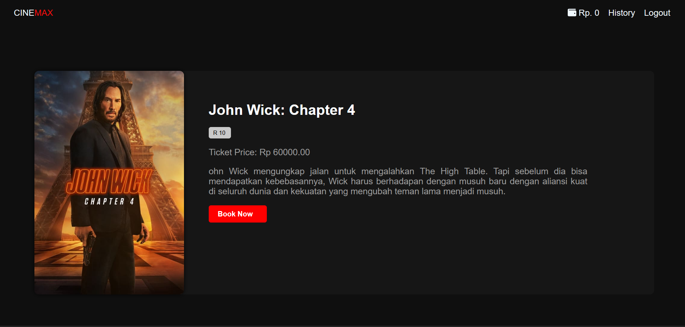

# CINEMAX


This is a web application built using Django that allows users to book movie tickets, manage their wallet balance, and view their transaction history.
## Features

- User Registration and Authentication: Users can register an account and log in to the application using their credentials. The authentication system is provided by Django's built-in authentication framework.
- Movie Listing: The application displays a list of available movies retrieved from an external API. The movies are stored in the database and include details such as title, description, age rating, poster image, and ticket price.
- Movie Details: Users can view detailed information about a specific movie, including its title, description, age rating, and ticket price.
- Wallet Management: Each user has a wallet balance associated with their account. Users can view their current balance and perform two actions: withdraw and top-up. The withdrawal functionality deducts a specified amount from the wallet balance if the balance is sufficient. The top-up functionality adds a specified amount to the wallet balance.
- Transaction History: Users can view their transaction history, which includes details of their ticket bookings. The history displays the customer name, movie title, seat numbers, date, total cost, and an option to cancel the booking.


## Installation

Clone the repository to your local machine.
```bash
git clone https://github.com/rifqifazzam/Cinemax.git
```
Navigate to the project directory:
```bash
cd Cinemax
```

Install the project dependencies using
```bash
pip install -r requirements.txt
```

Run the database migrations 
```bash
python manage.py migrate
```

Start the development server using
```bash
python manage.py runserver
```
## Tech Stack

**Front-end** HTML, CSS, Javascript

**Back-end** Django

## Screenshots

<!-- add image docum -->
<!-- get from screenshot folder -->
#### Registation and Login


#### Homepage


#### Movie Details


#### Booking


#### Wallet


#### Transaction History


## Documentation

[Git-clone](https://docs.github.com/en/repositories/creating-and-managing-repositories/cloning-a-repository)

[Django](https://docs.djangoproject.com/en/4.2/)
